# Vault Guard Web - 您的密碼管理器

Vault Guard Web 為免費且開放原始碼的網頁應用程式，提供使用者密碼管理的功能。

此為專案的後端部分，需搭配前端一起部署。

前端: [keke125/vault-guard-web-react](https://github.com/keke125/vault-guard-web-react)

## 簡介

本專案為網頁應用程式，程式提供使用者產生、儲存、搜尋、備份密碼的功能，同時也提供產生TOTP驗證碼的功能，使用者可以將其作為密碼器使用，或是單純用於兩步驟驗證的驗證器(例如: Google Authenticator、Microsoft Authenticator、Authy)使用。

## 技術

### 程式語言、框架、函式庫、專案管理、資料庫

### 版本控制、CI/CD

### 支援部署在 Linux 作業系統、容器化

### 推薦使用的網頁伺服器

## 授權條款

## Q & A

* 什麼是TOTP驗證碼?

    TOTP（Time-Based One-Time Password）驗證碼是一種基於時間的一次性驗證碼，用於雙因素驗證（2FA）或多因素驗證（MFA）系統，它會根據當前時間產生一個短暫有效的驗證碼，通常是6位或8位數字，並每隔30秒或60秒自動更新，因為有效期較短，相比密碼來說被盜用的損失也較小，因為實作成本較低，常作為一種雙重驗證的方式。

## 程式截圖

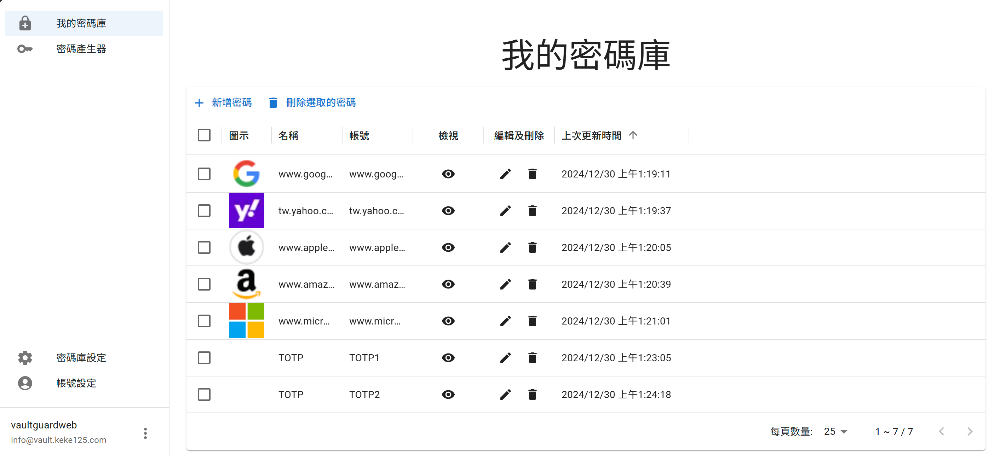
我的密碼庫

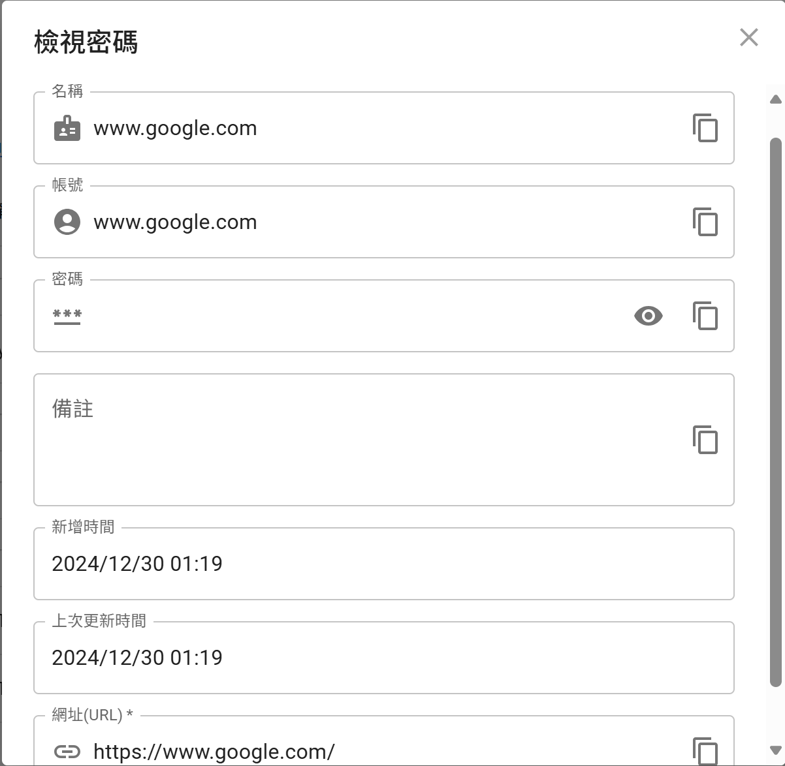
檢視密碼

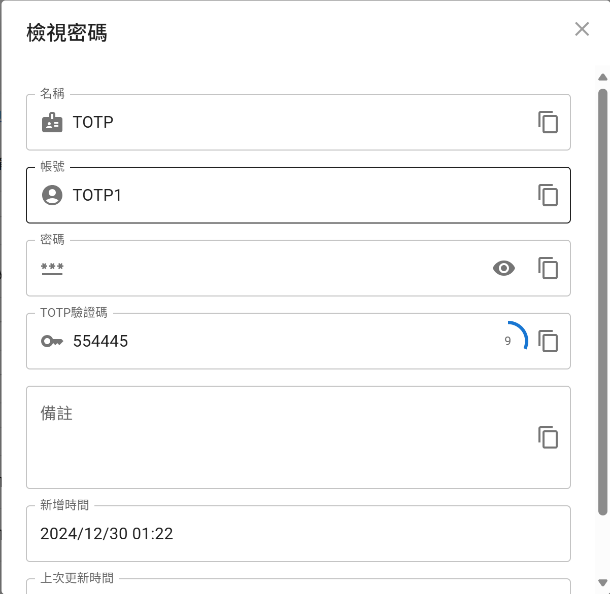
檢視密碼 - TOTP驗證碼

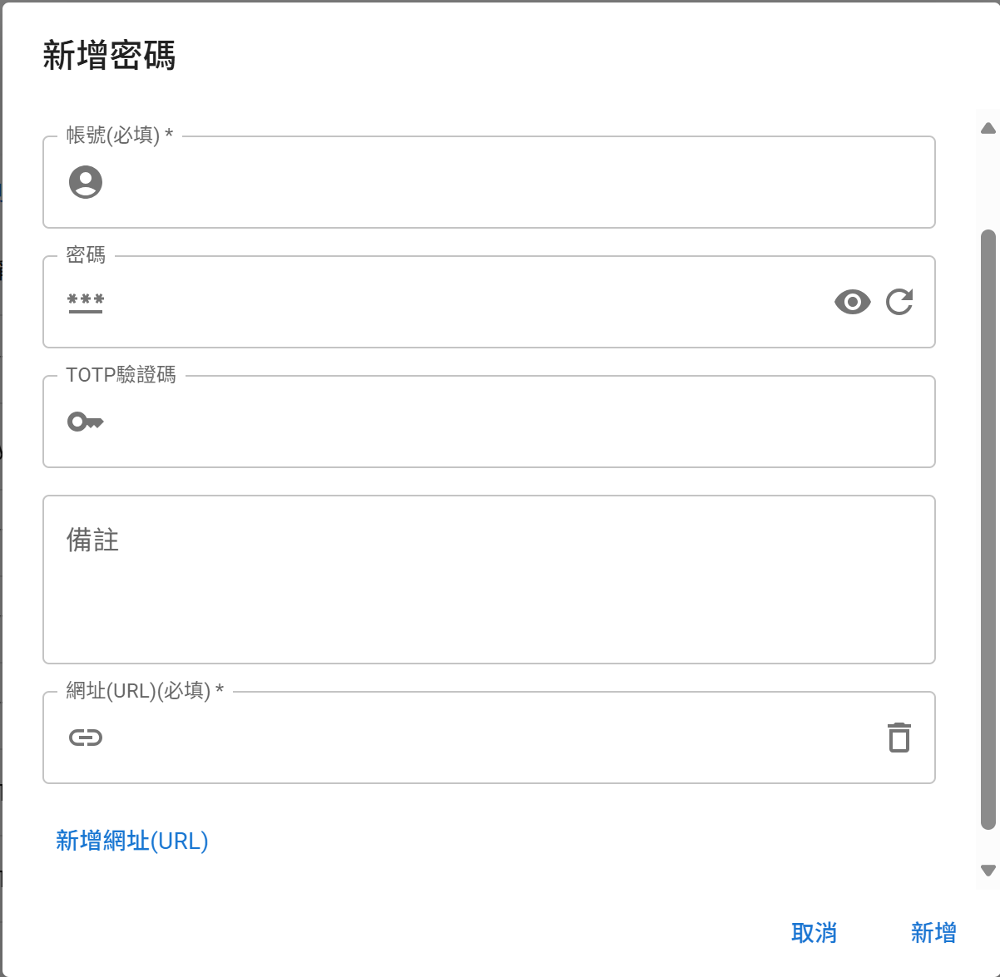
新增密碼

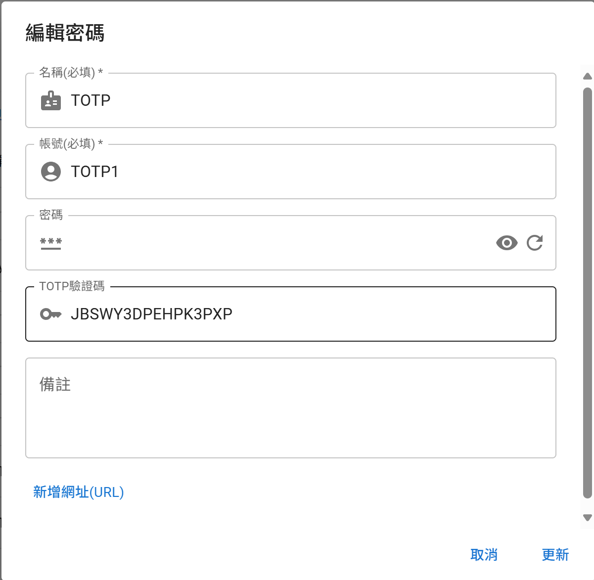
編輯密碼

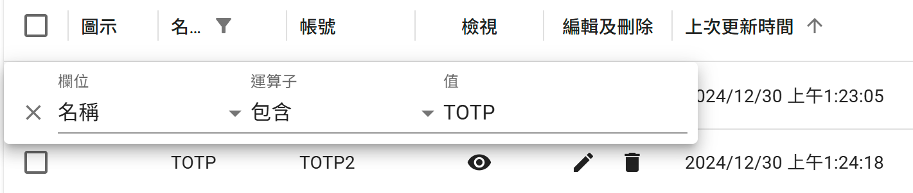
根據條件搜尋密碼

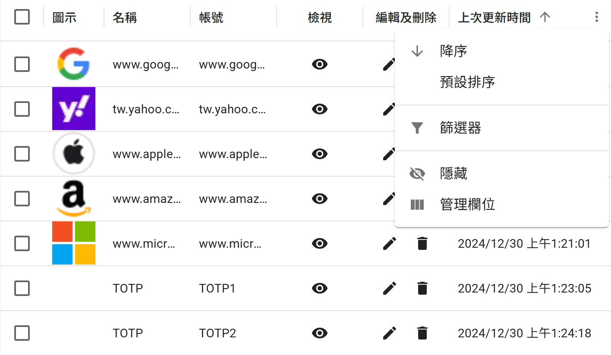
根據欄位排序密碼

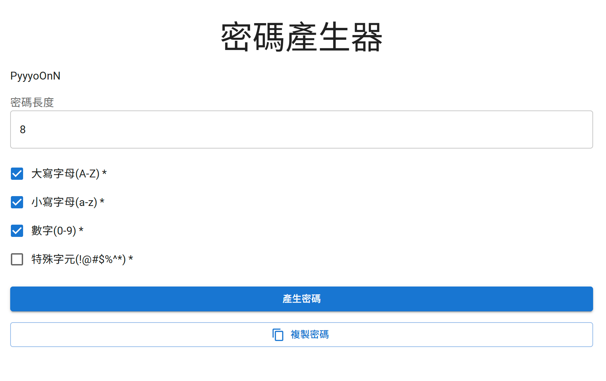
密碼產生器

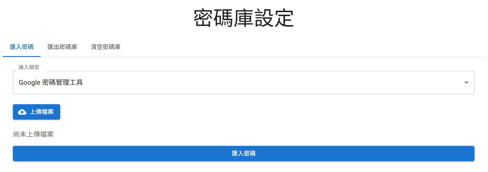
密碼庫設定

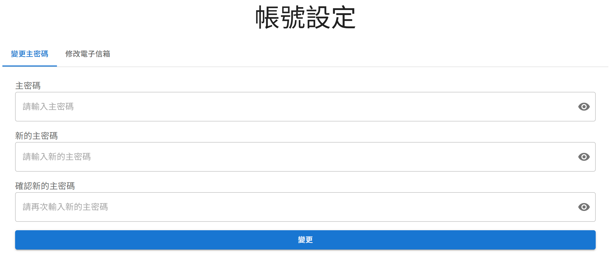
帳號設定

## 主要特色

* 整合TOTP驗證碼
* 支援RWD
* 支援PWA
* 支援從Google密碼管理器匯入密碼
* 支援匯入匯出密碼庫
* 方便自架 - 透過 Docker Compose，可一次部署前端、後端、資料庫。
* 效能 - 在 Google Lighthouse 獲得滿分成績。
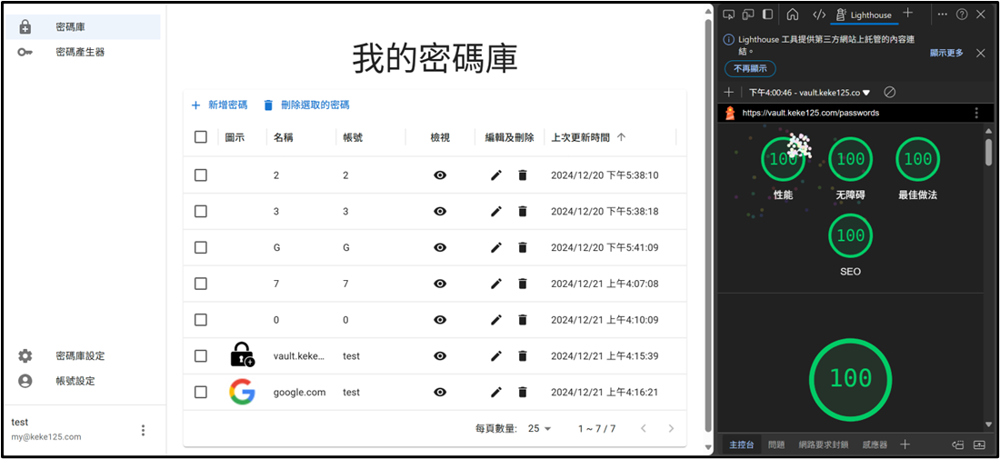

